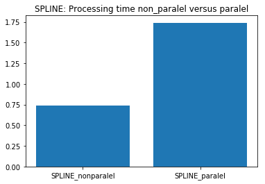
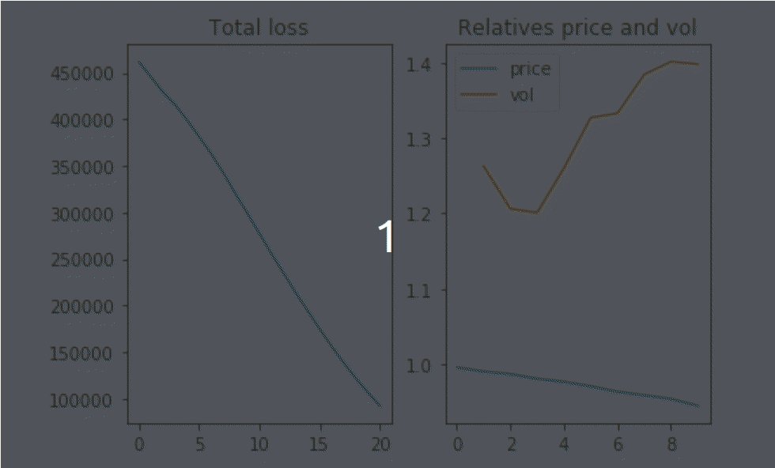

<!DOCTYPE html>
<html>
<head>

</head>
<body>
  

    <h1> Fixed income securities analysis</h1>
    <!--Instalation-->
    

      <h2 align="left">Instalation</h2>
      
First you need to install <a href=https://conda.io/docs/user-guide/install/index.html>anaconda</a>

      
    

    <!--Bootstrapping-->
    

      <h2 align="left">Bootstrapping and Interpolation:</h2>
      <h3>Features</h3>
      <ul>
        <li>Bootstrap strip rates from historical rates given by the US treasury</li>
        <li>Interpolate the term structure</li>
      </ul>
      <h3>Enhancements:</h3>
      <ul>
        <li>Paralel multiprocessing to increase bootsraping speed: 80% reduction in processing time</li>
      </ul>
      
    

    <!--BDT-->
    

      <h2 align="left">Black-Derman-Toy </h2>
      <h3>Features</h3>
      <ul>
        <li>Fit the model to a term structure and historical volatility data</li>
        <li>Value callable/puttable bonds</li>
      </ul>
      <h3>Enhancements:</h3>
      <ul>
        <li>Load historical rate</li>
        <li>Bootstrao and interpolate the term structure</li>
        <ul>
          <li>Paralel multiprocessing to increase bootsraping speed: 80% reduction in processing time</li>
        </ul>
        <li>Estimate historical volatilities</li>
        <ul>Fit the model</li>
        <li>Use an Adam solver to fit the model</li>
        <ul>
          <li>Calculate numerical gradient with paralel processing, or not</li>
          <li>Visualize the model loss and the ratio of model prices or volatility to real price or volatility</li>
          
        </ul>
      </ul>
    

    <!--Vasicek-->
    

      <h2 align="left">Vasicek</h2>
      <h3>Features</h3>
      <ul>
        <li>Fit the model</li>
        <li>Value a callable/puttable zero-coupon bond</li>
      </ul>
    

  

</body>
<html>
